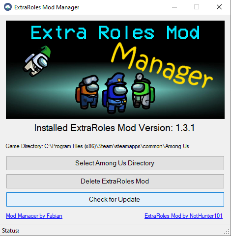

# Extra Roles Mod Manager
A small tool written in C# to manage the installation of the ExtraRoles Mod for Among Us by [NotHunter101](https://github.com/NotHunter101/ExtraRolesAmongUs)

# How to Use

## Preparation
* Download the [latest release](https://github.com/heinzef/ExtraRolesAmongUs-Manager/releases/latest) of the Mod Manager.
* Extract the .zip file to a folder based on your choice and run the ExtraRolesModManager.exe
* You may get a security warning because the .exe file isn't signed. If you don't want it feel free to clone the repository and compile the source code and run the built .exe file.

## Using the Mod Manager

### Selecting the root directory
* Click on *Select Among Us Directory* and navigate and choose the root folder of your Among Us Game. It is the folder where also the *Among Us.exe* file is located.

### Installing / Updating the mod
* When you selected the root directory click on *Check for Update* to scan for the latest release of the ExtraRoles Mod. If there is a newer version you will be asked if you want to install it. Click on *Yes* and the files will be downloaded and extracted to your chosen game directory. The old version will be overwritten.
* After that it should update the *Installed ExtraRoles Mod Version Label* with the one you just installed.
* If you don't have a older version installed - Don't worry. It is still the same procedure.

### Deleting the mod files
* When you want to delete all the files of the Extra Roles Mod and its dependencies you can click on *Delete ExtraRoles Mod*. After confirm all the files will be deleted from your game directory and you have the "normal Among Us" back.

# Resources
[ExtraRoles by NotHunter101](https://github.com/NotHunter101/ExtraRolesAmongUs)

